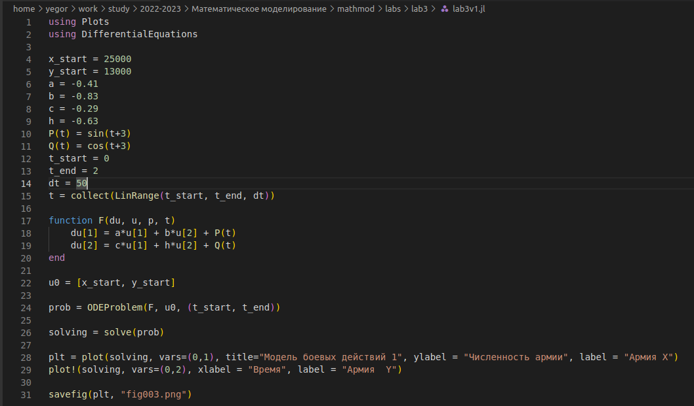
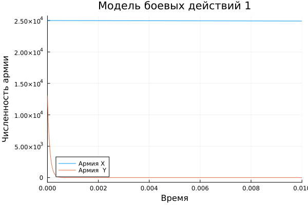
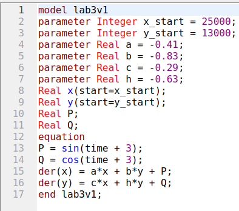
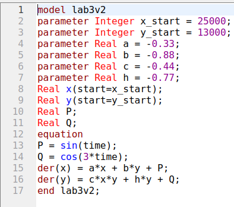
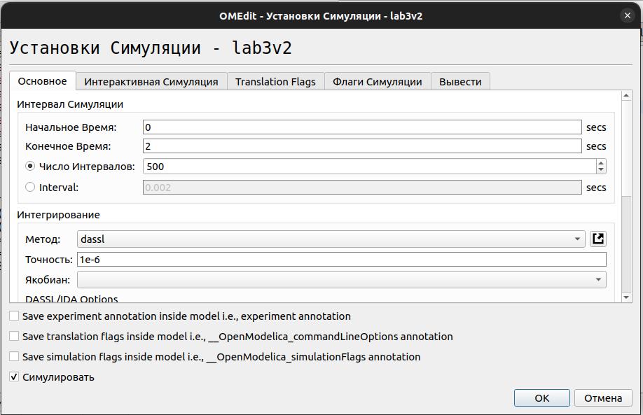

---
## Front matter
lang: ru-RU
title: Лабораторная работа №3
subtitle: Модель боевных действий
author:
  - Логинов Е. И.
institute:
  - Российский университет дружбы народов, Москва, Россия
date: 25.02.2023

## i18n babel
babel-lang: russian
babel-otherlangs: english

## Formatting pdf
toc: false
toc-title: Содержание
slide_level: 2
aspectratio: 169
section-titles: true
theme: metropolis
mainfont: PT Serif 
romanfont: PT Serif 
sansfont: PT Sans
monofont: PT Mono
header-includes:
 - \metroset{progressbar=frametitle,sectionpage=progressbar,numbering=fraction}
 - '\makeatletter'
 - '\beamer@ignorenonframefalse'
 - '\makeatother'
---

# Информация

## Докладчик

:::::::::::::: {.columns align=center}
::: {.column width="70%"}

  * Логинов Егор Игоревич
  * студент НФИбд-01-20
  * Российский университет дружбы народов
  * [1032201661@pfur.ru](mailto:1032201661@pfur.ru)

:::
::::::::::::::

# Вводная часть

## Актуальность

- Моделирование ситуации
- Наглядное представление
- Простота использования

## Цели и задачи

- Сделать моделирование боевых действий
- Представить результаты в виде графиков

## Материалы и методы

- Язык `Julia` и ее библиотеки: `Plots` и `DifferentialEquations` для построения графиков
- Свободное открытое программное обеспечение `OpenModelica` для моделирования ситуации
 
# Ход работы

## Построение двух простейших моделей боя

1. Модель боевых действий между регулярными войсками описывается следующим ОДУ

  dx/dt = - ax(t) - bx(t) + P(t)  
  dy/dt = - cx(t) - hy(t) + Q(t) 
 
2. Модель ведение боевых действий с участием регулярных войск и
партизанских отрядов

  dx/dt = - a(t)x(t) - b(t)x(t) + P(t)  
  dy/dt = - c(t)x(t)y(t) - h(t)y(t) + Q(t)  

где: 
a,b,c,h - постоянные коэффициенты  
a(t), h(t) - коэффициенты, описывающие потери, не связанные с боевыми действиями  
c(t), b(t) - коэффициенты, описывающие потери, связанные с боевыми действиями  
P(t), Q(t) - функции, учитывающие возможность подхода подкрепления к войскам  

## Код моделирования на Julia, модель 1

{#fig:001 heigh=90% width=70%}

## График моделирования первой модели 

{#fig:002 heigh=90% width=70%}

# Код моделирования на Julia, модель 2

{#fig:003 heigh=90% width=70%}

## График моделирования второй модели 

{#fig:004 heigh=90% width=70%}

## Код на OpenModelica. Первая модель 

{#fig:005 heigh=90% width=70%}

## Код на OpenModelica. Вторая модель 
{#fig:006 heigh=90% width=70%}

## Установка настроек симуляции

{#fig:007 heigh=90% width=70%}

## График первой модели 
{#fig:008 heigh=90% width=70%}

## График второй модели

{#fig:009 heigh=90% width=70%}

# Результаты
## Результаты выполнения

- Моделирование ситуации
- Ознакомление с языками
- Исследование графиков
- Сравнение языков
