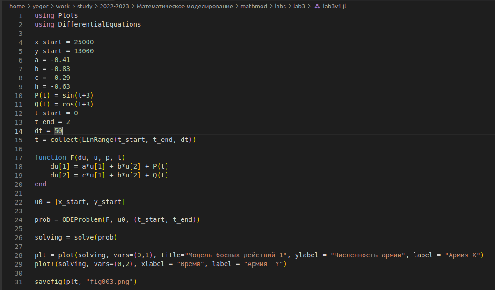
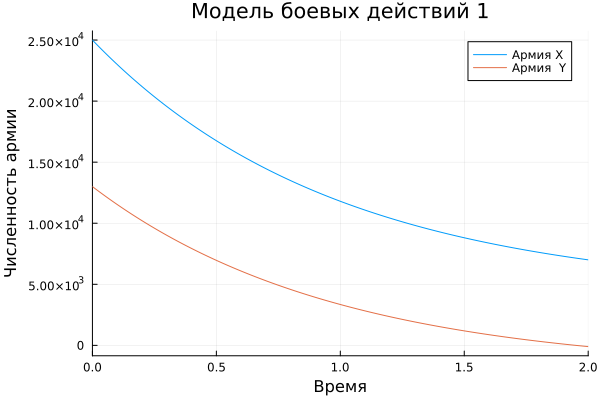
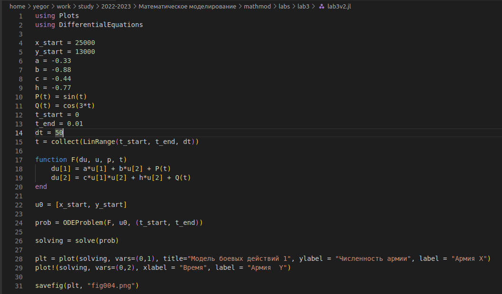
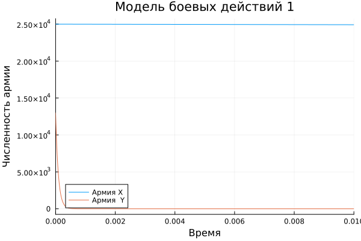
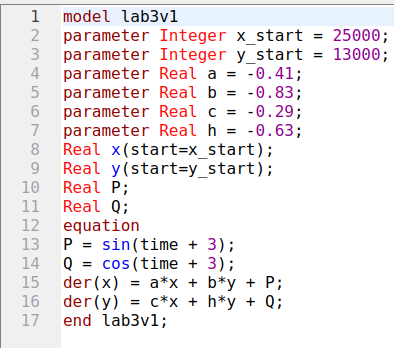
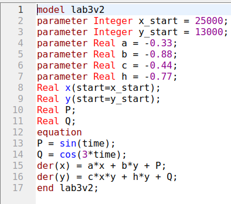
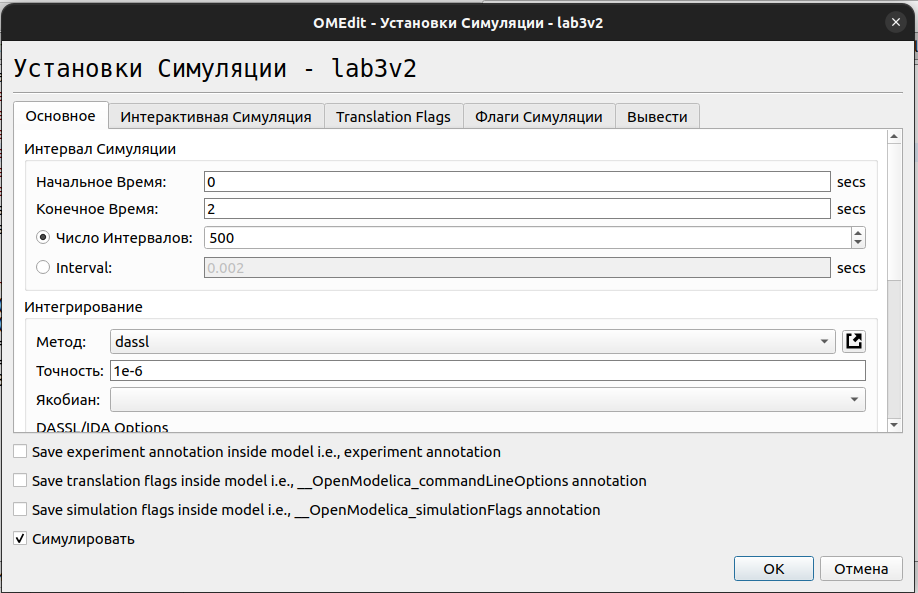
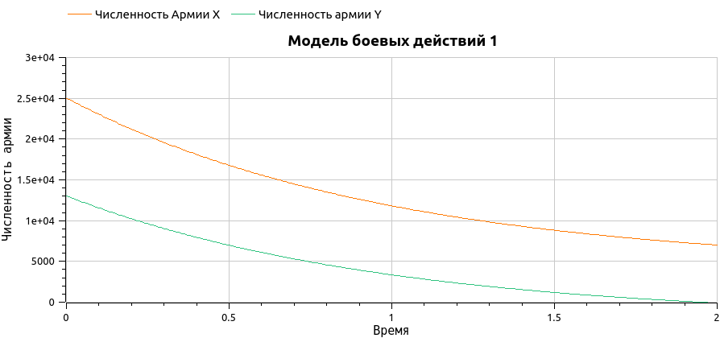
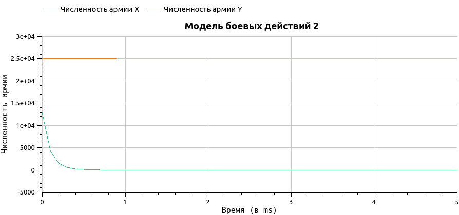

---
## Front matter
title: "Лабораторная работа №3"
subtitle: "Модель боевых действий"
author: "Логинов Егор Игоревич"

## Generic otions
lang: ru-RU
toc-title: "Содержание"

## Bibliography
bibliography: bib/cite.bib
csl: pandoc/csl/gost-r-7-0-5-2008-numeric.csl

## Pdf output format
toc: true # Table of contents
toc-depth: 2
lof: true # List of figures
lot: true # List of tables
fontsize: 12pt
linestretch: 1.5
papersize: a4
documentclass: scrreprt
## I18n polyglossia
polyglossia-lang:
  name: russian
  options:
	- spelling=modern
	- babelshorthands=true
polyglossia-otherlangs:
  name: english
## I18n babel
babel-lang: russian
babel-otherlangs: english
## Fonts
mainfont: PT Serif
romanfont: PT Serif
sansfont: PT Sans
monofont: PT Mono
mainfontoptions: Ligatures=TeX
romanfontoptions: Ligatures=TeX
sansfontoptions: Ligatures=TeX,Scale=MatchLowercase
monofontoptions: Scale=MatchLowercase,Scale=0.9
## Biblatex
biblatex: true
biblio-style: "gost-numeric"
biblatexoptions:
  - parentracker=true
  - backend=biber
  - hyperref=auto
  - language=auto
  - autolang=other*
  - citestyle=gost-numeric
## Pandoc-crossref LaTeX customization
figureTitle: "Рис."
tableTitle: "Таблица"
listingTitle: "Листинг"
lofTitle: "Список иллюстраций"
lotTitle: "Список таблиц"
lolTitle: "Листинги"
## Misc options
indent: true
header-includes:
  - \usepackage{indentfirst}
  - \usepackage{float} # keep figures where there are in the text
  - \floatplacement{figure}{H} # keep figures where there are in the text
---

# Цель работы

Построить модели боевых действий на языках Julia и OpenModelica. Решить ОДУ 1 порядка с помощью графиков и рассмотреть модели боевых действий между регулярными войсками. Рассмотреть модель ведения боевых действий с участием регулярных войск и партизанских отрядов.

# Задание

Рассмотреть две модели Ланчестера - простейшие модели боевых действий:  

1. Модель боевых действий между регулярными войсками

2. Модель ведение боевых действий с участием регулярных войск и партизанских отрядов

Проверить, как работает модель в различных ситуациях, построить графики y(t) и x(t) в рассматриваемых случаях.

# Теоретическое введение

1. Модель боевых действий между регулярными войсками описывается следующим ОДУ:

>dx/dt = - ax(t) - bx(t) + P(t)  
>dy/dt = - cx(t) - hy(t) + Q(t)  
2. Модель ведение боевых действий с участием регулярных войск и партизанских отрядов:
>dx/dt = - a(t)x(t) - b(t)x(t) + P(t)  
>dy/dt = - c(t)x(t)y(t) - h(t)y(t) + Q(t),
где: 
>a,b,c,h - постоянные коэффициенты  
>a(t), h(t) - коэффициенты, описывающие потери, не связанные с боевыми действиями  
>c(t), b(t) - коэффициенты, описывающие потери, связанные с боевыми действиями  
>P(t), Q(t) - функции, учитывающие возможность подхода подкрепления к войскам  
Подробнее о модели боевых действий в [@spravka;@model_lanchester]

# Выполнение лабораторной работы

Изучили теорию, приступаем к написанию кода на Julia. Решаем систему ОДУ [@julia_diff] c данными нам коэффициентами (рис. @fig:001).

{#fig:001 width=70%}

Рассмотрим полученный график: мы видим, что численность армии страны Y первой достигла 0. Соотвественно, страна Y проиграла (рис. @fig:002).

{#fig:002 width=70%}

На втором графике проигрывает армия страны Y (рис. @fig:003) (рис. @fig:004).

{#fig:003 width=70%}

{#fig:004 width=70%}

Дальше переходим к написанию кода на OpenModelica. Решаем систему ОДУ и получаем первую модель (рис. @fig:005).

{#fig:005 width=70%}

Наша вторая модель (рис. @fig:006).

{#fig:006 width=70%}

Делаем установку настроек симуляции (рис. @fig:007).

{#fig:007 width=70%}

Получаем графики моделей боя (рис. @fig:008) (рис. @fig:009).

Графики похожи на графики в Julia, значит мы сделали все верно. Исходы боя получили аналогичным на Julia.

{#fig:008 width=70%}

На втором графике проигрывает армия Y (рис. @fig:009).

{#fig:009 width=70%}

# Выводы

В ходе лабораторной работы были получены навыки работы с простейшими моделями боевых действий. Улучшены навыки работы с Julia и OpenModelica. Результат работы - графики, наглядко показывающие результат. Если сравнивать данные языки программирования, то для решения этой задачи OpenModelica кажется проще в реализации и быстрее в скорости выполнения. Очень удобный интерфейс, с которым получилось легко разобраться и работать.

# Список литературы{.unnumbered}