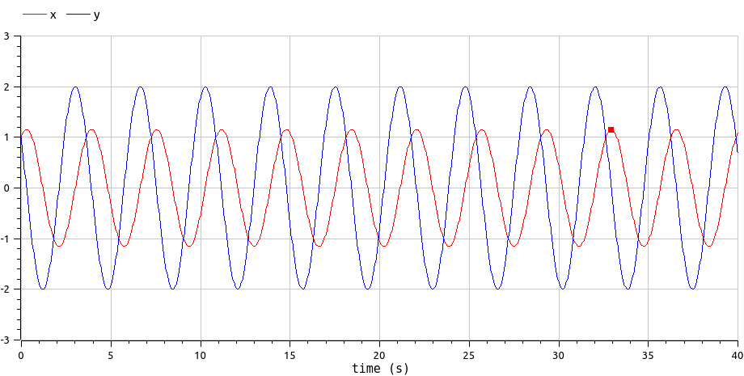
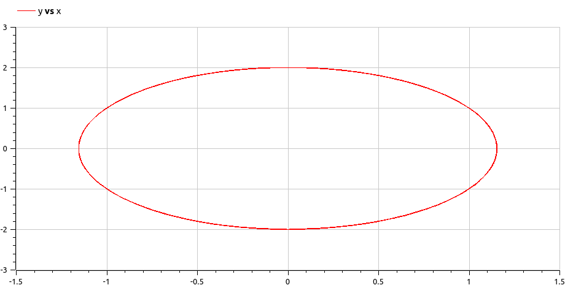
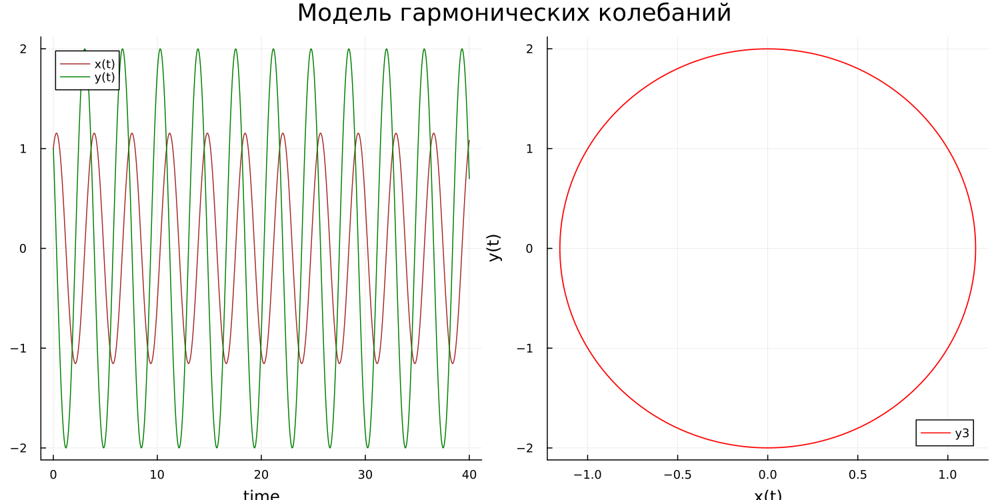
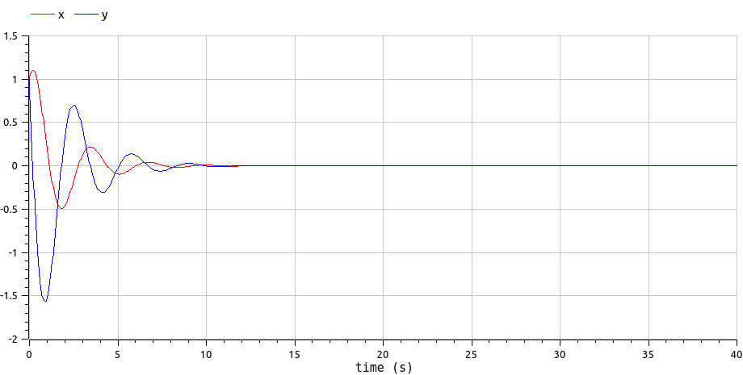
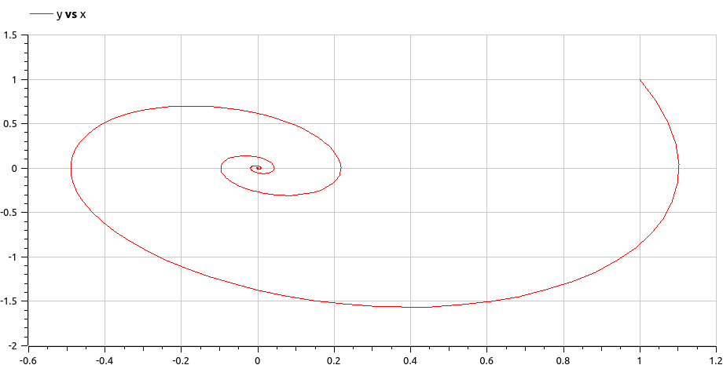
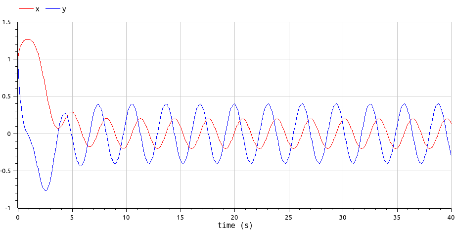
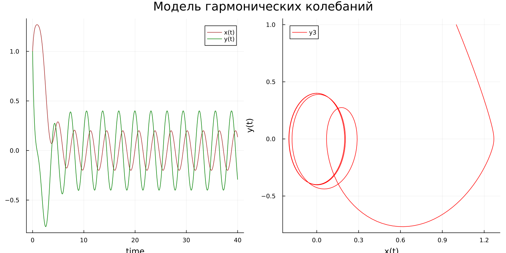

---
## Front matter
lang: ru-RU
title: Лабораторная работа №4
subtitle: Гармонический осцилятор
author:
  - Логинов Е. И.
institute:
  - Российский университет дружбы народов, Москва, Россия
date: 4 марта 2023

## i18n babel
babel-lang: russian
babel-otherlangs: english

## Formatting pdf
toc: false
toc-title: Содержание
slide_level: 2
aspectratio: 169
section-titles: true
theme: metropolis
mainfont: PT Serif
romanfont: PT Serif
sansfont: PT Sans
monofont: PT Mono
header-includes:
 - \metroset{progressbar=frametitle,sectionpage=progressbar,numbering=fraction}
 - '\makeatletter'
 - '\beamer@ignorenonframefalse'
 - '\makeatother'
---

# Цели и задачи работы

## Цель лабораторной работы

Изучить уравнение гармонического осцилятора, построить фазовый портрет гармонического осциллятора и решение уравнения гармонического осциллятора.

## Задание к лабораторной работе

1.	Построить решение уравнения гармонического осциллятора без затухания
2.	Записать уравнение свободных колебаний гармонического осциллятора с затуханием, построить его решение. Построить фазовый портрет гармонических колебаний с затуханием.
3.	Записать уравнение колебаний гармонического осциллятора, если на систему действует внешняя сила, построить его решение. Построить фазовый портрет колебаний с действием внешней силы.

# Процесс выполнения лабораторной работы

## Теоретический материал 

Движение грузика на пружинке, маятника, заряда в электрическом контуре, а также эволюция во времени многих систем в физике, химии, биологии и других науках при определенных предположениях можно описать одним и тем же дифференциальным уравнением, которое в теории колебаний выступает в качестве основной модели. Эта модель называется линейным гармоническим осциллятором.
Уравнение свободных колебаний гармонического осциллятора имеет следующий вид:
$$\ddot{x}+2\gamma\dot{x}+\omega_0^2=0$$

## Теоретический материал 

При отсутствии потерь в системе ( $\gamma=0$ ) получаем уравнение консервативного осциллятора энергия колебания которого сохраняется во времени.
$$\ddot{x}+\omega_0^2x=0$$
Для однозначной разрешимости уравнения второго порядка необходимо задать два начальных условия вида
 
$$
 \begin{cases}
	x(t_0)=x_0
	\\   
	\dot{x(t_0)}=y_0
 \end{cases}
$$

## Теоретический материал 

Уравнение второго порядка можно представить в виде системы двух уравнений первого порядка:

$$
 \begin{cases}
	x=y
	\\   
	y=-\omega_0^2x
 \end{cases}
$$

Начальные условия для системы примут вид:

$$
 \begin{cases}
	x(t_0)=x_0
	\\   
	y(t_0)=y_0
 \end{cases}
$$

## Условие задачи

Постройте фазовый портрет гармонического осциллятора и решение уравнения гармонического осциллятора для следующих случаев 

1. Колебания гармонического осциллятора без затуханий и без действий внешней
силы $\ddot{x}+3x=0$
2. Колебания гармонического осциллятора c затуханием и без действий внешней
силы $\ddot{x}+\dot{x}+4x=0$
3. Колебания гармонического осциллятора c затуханием и под действием внешней
силы $\ddot{x}+2\dot{x}+x=\sin{2t}$

На итнтервале $t \in [ 0;40 ]$, шаг 0.05, $x_0=1, y_0=1$

## Колебания гармонического осциллятора без затуханий и без действий внешней силы OpenModelica - решение уравнения

{ #fig:001 width=70% height=70% }

## Колебания гармонического осциллятора без затуханий и без действий внешней силы OpenModelica - фазовый портрет

{ #fig:002 width=70% height=70% }

## Колебания гармонического осциллятора без затуханий и без действий внешней силы Julia - решение уравнения и фазовый портрет

{ #fig:003 width=70% height=70% }

## Колебания гармонического осциллятора с затуханием и без действий внешней силы OpenModelica - решение уравнения

{ #fig:004 width=70% height=70% }

## Колебания гармонического осциллятора с затуханием и без действий внешней силы OpenModelica - фазовый портрет

{ #fig:005 width=70% height=70% }

## Колебания гармонического осциллятора с затуханием и без действий внешней силы Julia - решение уравнения и фазовый портрет

{ #fig:006 width=70% height=70% }

## Колебания гармонического осциллятора с затуханием при действии внешней силы OpenModelica - решение уравнения

{ #fig:007 width=70% height=70% }

## Колебания гармонического осциллятора с затуханием при действии внешней силы OpenModelica - фазовый портрет

{ #fig:008 width=70% height=70% }

## Колебания гармонического осциллятора с затуханием при действии внешней силы Julia - решение уравнения и фазовый портрет

{ #fig:009 width=70% height=70% }

# Выводы по проделанной работе

В ходе выполнения лабораторной работы были построены решения уравнения гармонического осциллятора и фазовые портреты гармонических колебаний в трех случаях: без затухания, с затуханием и при действии внешней силы.