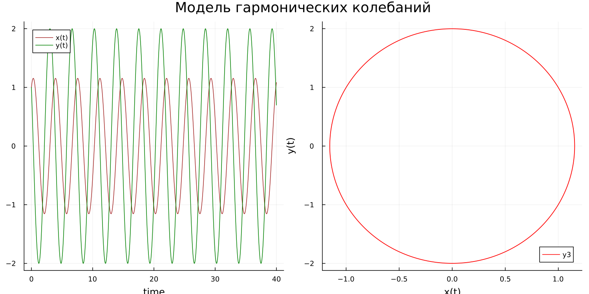

---
## Front matter
title: "Отчёт по лабораторной работе №4"
subtitle: "Модель гармонических колебаний"
author: "Логинов Е.И."

## Generic otions
lang: ru-RU
toc-title: "Содержание"

## Bibliography
bibliography: bib/cite.bib
csl: pandoc/csl/gost-r-7-0-5-2008-numeric.csl

## Pdf output format
toc: true # Table of contents
toc-depth: 2
lof: true # List of figures
lot: true # List of tables
fontsize: 12pt
linestretch: 1.5
papersize: a4
documentclass: scrreprt
## I18n polyglossia
polyglossia-lang:
  name: russian
  options:
	- spelling=modern
	- babelshorthands=true
polyglossia-otherlangs:
  name: english
## I18n babel
babel-lang: russian
babel-otherlangs: english
## Fonts
mainfont: PT Serif
romanfont: PT Serif
sansfont: PT Sans
monofont: PT Mono
mainfontoptions: Ligatures=TeX
romanfontoptions: Ligatures=TeX
sansfontoptions: Ligatures=TeX,Scale=MatchLowercase
monofontoptions: Scale=MatchLowercase,Scale=0.9
## Biblatex
biblatex: true
biblio-style: "gost-numeric"
biblatexoptions:
  - parentracker=true
  - backend=biber
  - hyperref=auto
  - language=auto
  - autolang=other*
  - citestyle=gost-numeric
## Pandoc-crossref LaTeX customization
figureTitle: "Рис."
tableTitle: "Таблица"
listingTitle: "Листинг"
lofTitle: "Список иллюстраций"
lotTitle: "Список таблиц"
lolTitle: "Листинги"
## Misc options
indent: true
header-includes:
  - \usepackage{indentfirst}
  - \usepackage{float} # keep figures where there are in the text
  - \floatplacement{figure}{H} # keep figures where there are in the text
---

# Подготовил

* Логинов Егор Игоревич

* Группа НФИбд-01-20

* Студ. билет 1032201661

# Цель работы

Изучить уравнение гармонического осцилятора, построить фазовый портрет гармонического осциллятора и решение уравнения гармонического осциллятора.

# Теоретическое введение
Движение грузика на пружинке, маятника, заряда в электрическом контуре, а
также эволюция во времени многих систем в физике, химии, биологии и других
науках при определенных предположениях можно описать одним и тем же
дифференциальным уравнением, которое в теории колебаний выступает в качестве
основной модели. Эта модель называется линейным гармоническим осциллятором. [@esystem-lab3]

Уравнение свободных колебаний гармонического осциллятора имеет следующий вид:
$$\ddot{x}+2\gamma\dot{x}+\omega_0^2=0$$

где $x$ - переменная, описывающая состояние системы (смещение грузика, заряд конденсатора и т.д.), $\gamma$ - параметр, характеризующий потери энергии (трение в механической системе, сопротивление в контуре), $\omega_0$ - собственная частота колебаний.
Это уравнение есть линейное однородное дифференциальное  уравнение второго порядка и оно является примером линейной динамической системы.

При отсутствии потерь в системе ( $\gamma=0$ ) получаем уравнение консервативного осциллятора энергия колебания которого сохраняется во времени.
$$\ddot{x}+\omega_0^2x=0$$

Для однозначной разрешимости уравнения второго порядка необходимо задать два начальных условия вида
 
$$
 \begin{cases}
	x(t_0)=x_0
	\\   
	\dot{x(t_0)}=y_0
 \end{cases}
$$

Уравнение второго порядка можно представить в виде системы двух уравнений первого порядка:

$$
 \begin{cases}
	x=y
	\\   
	y=-\omega_0^2x
 \end{cases}
$$

Начальные условия для системы примут вид:

$$
 \begin{cases}
	x(t_0)=x_0
	\\   
	y(t_0)=y_0
 \end{cases}
$$

Независимые	переменные	$x, y$	определяют	пространство,	в	котором «движется» решение. Это фазовое пространство системы, поскольку оно двумерно будем называть его фазовой плоскостью.
Значение фазовых координат $x, y$ в любой момент времени полностью определяет состояние системы. Решению уравнения движения как функции времени отвечает гладкая кривая в фазовой плоскости. Она называется фазовой траекторией. Если множество различных решений (соответствующих различным 
начальным условиям) изобразить на одной фазовой плоскости, возникает общая картина поведения системы. Такую картину, образованную набором фазовых траекторий, называют фазовым портретом.

# Задание

## Формулировка задания
 Вариант №2

Постройте фазовый портрет гармонического осциллятора [@ocszill] и решение уравнения
гармонического осциллятора для следующих случаев
1. Колебания гармонического осциллятора без затуханий и без действий внешней силы
$\ddot{x}+3x=0$
2. Колебания гармонического осциллятора c затуханием и без действий внешней силы
$\ddot{x}+\dot{x}+4x=0$
3. Колебания гармонического осциллятора c затуханием и под действием внешней силы
$\ddot{x}+2\dot{x}+x=\sin{2t}$
На итнтервале $t \in [ 0;40 ]$, шаг 0.05, $x_0=1, y_0=1$


# Выполнение лабораторной работы

1. Я начал выполнять данную работу с OpenModelica. [@openmodelicaODE]
Для первого случая, а именно без затуханий и без действий внешней
силы, я написал  следующий код:
```
model lab4v1
parameter Real x0 = 1;
parameter Real y0 = 1;
parameter Real omega_sq = 3;
Real x(start=x0);
Real y(start=y0);
equation
der(x) = y;
der(y) = -omega_sq * x;
end lab4v1;
```
Я получил следующий график решения уравнения гармонического осциллятора (рис. @fig:001), и следующий фазовый портрет (рис. @fig:002).

{#fig:001 width=70%}

{#fig:002 width=70%}

Для второго случая, а именно колебаний с затуханием и без воздействия внешней сиды, я написал следующий код:
```
model lab4v2
parameter Real x0 = 1;
parameter Real y0 = 1;
parameter Real omega_sq = 4;
parameter Real thetta = 1;
Real x(start=x0);
Real y(start=y0);
equation
der(x) = y;
der(y) = -thetta*y - omega_sq * x;
end lab4v2;
```
В результате получил так же решение уравнения гармонического осциллятора (рис. @fig:003), и фазовый портрет (рис. @fig:004).

{#fig:003 width=70%}

{#fig:004 width=70%}

Для третьего уравнения, а именно  c затуханием и под действием внешней
силы, я написал следующий код:
```
model lab4v3
parameter Real x0 = 1;
parameter Real y0 = 1;
parameter Real omega_sq = 1;
parameter Real thetta = 2;
Real x(start=x0);
Real y(start=y0);
equation
der(x) = y;
der(y) = -thetta*y - omega_sq * x + sin(2*time);
end lab4v3;
```
В результате получили сначала решение уравнения гармонического осциллятора (рис. @fig:005), и так же фазовый портрет (рис. @fig:006).

{#fig:005 width=70%}

{#fig:006 width=70%}

2. Далее я написал код на языке Julia [@juliaODE]. Код программы для первого уравнения выглядит следующим образом:
```julia
# вариант 2
using Plots
using DifferentialEquations

T = (0.0, 40.0)
u0 = [1.0, 1.0]
omega_sq = 3 

function F(du, u, p, t)
    du[1] = u[2]
    du[2] = -omega_sq * u[1]
end

prob = ODEProblem(F, u0, T)
sol = solve(prob, saveat=0.05, abstol = 1e-8, reltol = 1e-8)

const X = []
const Y = []
Time = sol.t

for u in sol.u
    x, y = u 
    push!(X, x)
    push!(Y, y)
end

plt = plot(dpi = 150, layout =(1,2), size=(1000, 500), plot_title = "Модель гармонических колебаний")
plot!(plt[1], Time, [X, Y], color = [:brown :green], xlabel = "time", label = ["x(t)" "y(t)"])
plot!(plt[2], X, Y, color = [:red], xlabel = "x(t)", ylabel="y(t)")

savefig(plt, "lab4_1_jl.png")
```

В результате работы программы создались следующие графики (рис. @fig:007):

{ #fig:007 width=50% height=50% }

Код программы для второго уравнения выглядит следующим образом:
```julia
# вариант 2
using Plots
using DifferentialEquations

T = (0.0, 40.0)
u0 = [1.0, 1.0]
thetta = 1
omega_sq = 4

function F(du, u, p, t)
    du[1] = u[2]
    du[2] = -thetta*u[2] - omega_sq * u[1]
end

prob = ODEProblem(F, u0, T)
sol = solve(prob, saveat=0.05, abstol = 1e-8, reltol = 1e-8)

const X = []
const Y = []
Time = sol.t

for u in sol.u
    x, y = u 
    push!(X, x)
    push!(Y, y)
end

plt = plot(dpi = 150, layout =(1,2), size=(1000, 500), plot_title = "Модель гармонических колебаний")
plot!(plt[1], Time, [X, Y], color = [:brown :green], xlabel = "time", label = ["x(t)" "y(t)"])
plot!(plt[2], X, Y, color = [:red], xlabel = "x(t)", ylabel="y(t)")

savefig(plt, "lab4_2_jl.png")
```
В результате работы программы создались следующие графики (рис. @fig:008):

{ #fig:008 width=50% height=50% }

Код программы для третьего уравнения выглядит следующим образом:
```julia
# вариант 2
using Plots
using DifferentialEquations

T = (0.0, 40.0)
u0 = [1.0, 1.0]
thetta = 2
omega_sq = 1
Q(t) = sin(2*t)

function F(du, u, p, t)
    du[1] = u[2]
    du[2] = -thetta*u[2] - omega_sq * u[1] + Q(t)
end

prob = ODEProblem(F, u0, T)
sol = solve(prob, saveat=0.05, abstol = 1e-8, reltol = 1e-8)

const X = []
const Y = []
Time = sol.t

for u in sol.u
    x, y = u 
    push!(X, x)
    push!(Y, y)
end

plt = plot(dpi = 150, layout =(1,2), size=(1000, 500), plot_title = "Модель гармонических колебаний")
plot!(plt[1], Time, [X, Y], color = [:brown :green], xlabel = "time", label = ["x(t)" "y(t)"])
plot!(plt[2], X, Y, color = [:red], xlabel = "x(t)", ylabel="y(t)")

savefig(plt, "lab4_3_jl.png")
```

В результате работы программы создались следующие графики (рис. @fig:009):

{ #fig:009 width=50% height=50% }

# Выводы
Мы рассмотрели модель гармонических колебаний, провели анализ и вывод дифференциальных уравнений, а так жк построили графики зависимости наших переменных от времени и фазовые графики зависимостей.

# Список используемой литературы {.unnumberd}

