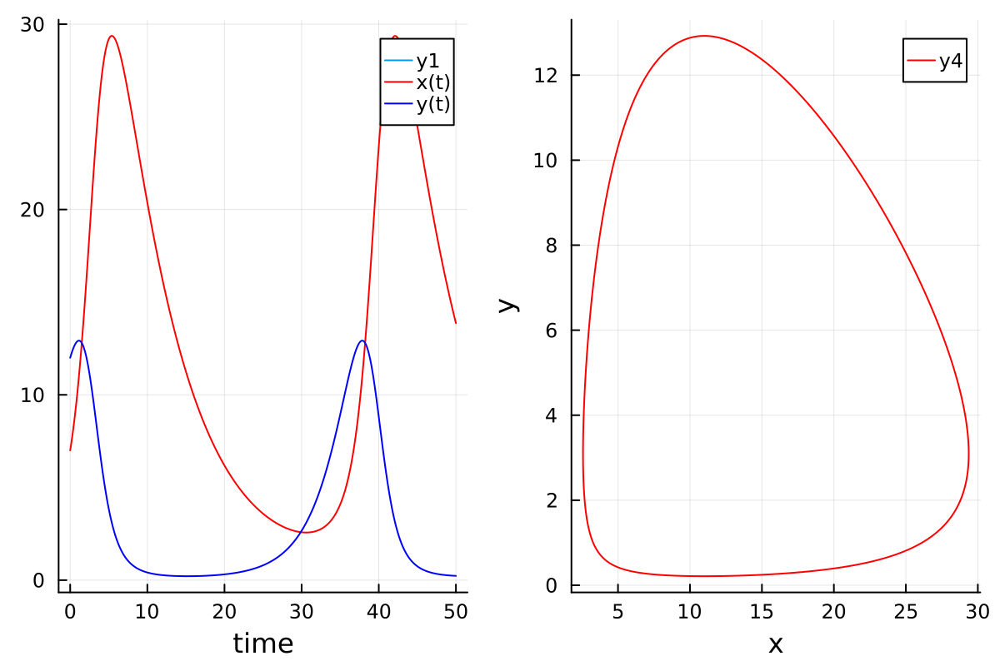
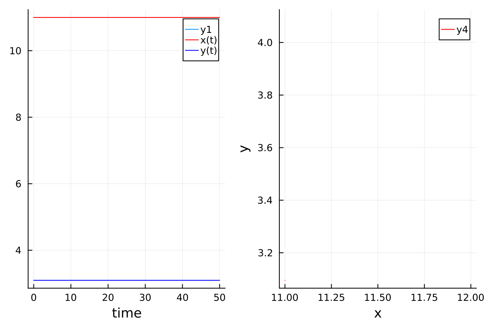
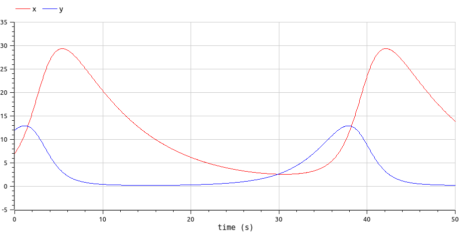
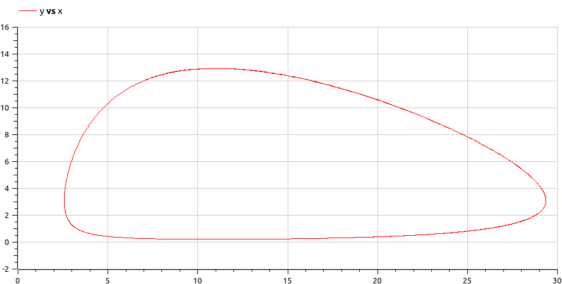
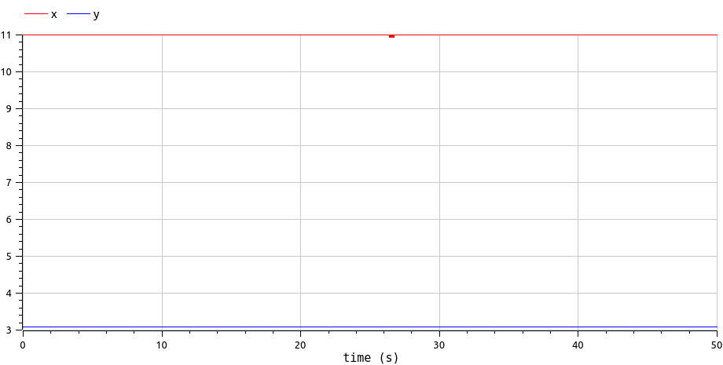
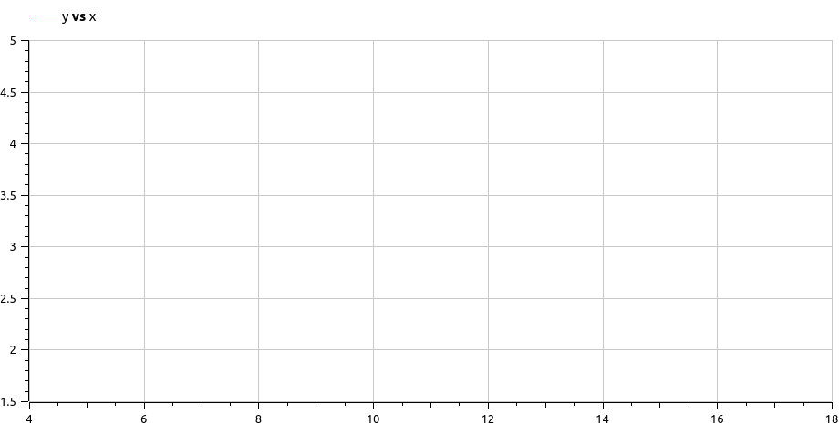

---
## Front matter
title: "Лабораторная работа №5"
subtitle: "Модель хищник-жертва"
author: "Логинов Е.И."

## Generic otions
lang: ru-RU
toc-title: "Содержание"

## Bibliography
bibliography: bib/cite.bib
csl: pandoc/csl/gost-r-7-0-5-2008-numeric.csl

## Pdf output format
toc: true # Table of contents
toc-depth: 2
lof: true # List of figures
lot: false # List of tables
fontsize: 12pt
linestretch: 1.5
papersize: a4
documentclass: scrreprt
## I18n polyglossia
polyglossia-lang:
  name: russian
  options:
	- spelling=modern
	- babelshorthands=true
polyglossia-otherlangs:
  name: english
## I18n babel
babel-lang: russian
babel-otherlangs: english
## Fonts
mainfont: PT Serif
romanfont: PT Serif
sansfont: PT Sans
monofont: PT Mono
mainfontoptions: Ligatures=TeX
romanfontoptions: Ligatures=TeX
sansfontoptions: Ligatures=TeX,Scale=MatchLowercase
monofontoptions: Scale=MatchLowercase,Scale=0.9
## Biblatex
biblatex: true
biblio-style: "gost-numeric"
biblatexoptions:
  - parentracker=true
  - backend=biber
  - hyperref=auto
  - language=auto
  - autolang=other*
  - citestyle=gost-numeric
## Pandoc-crossref LaTeX customization
figureTitle: "Рис."
tableTitle: "Таблица"
listingTitle: "Листинг"
lofTitle: "Список иллюстраций"
lotTitle: "Список таблиц"
lolTitle: "Листинги"
## Misc options
indent: true
header-includes:
  - \usepackage{indentfirst}
  - \usepackage{float} # keep figures where there are in the text
  - \floatplacement{figure}{H} # keep figures where there are in the text
---

# Цель работы

Рассмотреть модель хищник-жертва. Построить вышеуказанную модель средствами OpenModellica и Julia.

# Задачи

Для модели «хищник-жертва»:

$$
\begin{cases}
\frac{dx}{dt} = -0.13x(t) + 0.042x(t)y(t) \\
\frac{dy}{dt} = 0.33y(t) - 0.03x(t)y(t) \\
\end{cases}
$$

1. Построить график зависимости численности хищников от численности жертв, а также графики изменения численности хищников и численности жертв при следующих начальных условиях: $x_0 = 7$, $y_0 = 12$.

2. Найти стационарное состояние системы.

# Среда

-   Julia — высокоуровневый высокопроизводительный свободный язык программирования с динамической типизацией, созданный для математических вычислений. [@julia]

-   OpenModelica — свободное открытое программное обеспечение для моделирования, симуляции, оптимизации и анализа сложных динамических систем. [@openmodelica]

# Теоретическое введение

Простейшая модель взаимодействия двух видов типа «хищник — жертва» - модель Лотки-Вольтерры. Данная двувидовая модель основывается на следующих предположениях [@rudn_theory]:

1. Численность популяции жертв x и хищников y зависят только от времени (модель не учитывает пространственное распределение популяции на
   занимаемой территории);
2. В отсутствии взаимодействия численность видов изменяется по модели Мальтуса, при этом число жертв увеличивается, а число хищников падает;
3. Естественная смертность жертвы и естественная рождаемость хищника считаются несущественными;
4. Эффект насыщения численности обеих популяций не учитывается;
5. Скорость роста численности жертв уменьшается пропорционально численности хищников;

$$
\begin{cases}
\frac{dx}{dt} = ax(t) - bx(t)y(t) \\
\frac{dy}{dt} = -cy(t) + dx(t)y(t) \\
\end{cases}
$$

В этой модели $x$ – число жертв, $y$ - число хищников. Коэффициент $a$ описывает скорость естественного прироста числа жертв в отсутствие хищников, $с$ - естественное вымирание хищников, лишенных пищи в виде жертв. Вероятность взаимодействия жертвы и хищника считается пропорциональной как количеству жертв, так и числу самих хищников ($xy$). Каждый акт взаимодействия уменьшает
популяцию жертв, но способствует увеличению популяции хищников (члены $-bxy$ и $dxy$ в правой части уравнения).

Стационарное состояние данной системы (положение равновесия, не зависящее от времени решение) будет в точке:

$$
x_0 = \frac{c}{d},\ y_0 = \frac{a}{b}
$$

Если начальные значения задать в стационарном состоянии

$$
x(0) = x_0,\ y(0) = y_0
$$

то в любой момент времени численность популяций изменяться не будет. При малом отклонении от положения равновесия численности как хищника, так и жертвы с течением времени не возвращаются к равновесным значениям, а совершают периодические колебания вокруг стационарной точки. Амплитуда колебаний и их период определяется начальными значениями численностей $x(0)$, y(0). Колебания совершаются в противофазе.

# Выполнение лабораторной работы

1. Напишем программу на Julia. Подкючим пакеты "Plots" и "DifferentialEquations", объявим начальные данные. Далее объявим начальное условие для системы дифференциальных уравнений и промежуток времени, на котором будет проходить моделирование. После этого объявим функцию, представляющую систему. Построим график зависимости $x$ от $y$ и графики функций $x(t)$, $y(t)$. При помощи 'DifferentialEquations' зададим и решим систему ДУ, после чего построим графики функций $x(t)$, $y(t). Так же создадим два списка, в которых будут храниться точки уравнений. Воспользуемся данным списком, чтобы построить график зависимости $x$ от $y$.

```Julia
using Plots 
using DifferentialEquations

a = 0.13
b = 0.042
c = 0.33
d = 0.03

u0 = [7, 12]
T = (0, 50)

function F!(du, u, p, t)
    du[1] = -a*u[1] + b*u[1]*u[2]
    du[2] = c*u[2] - d*u[1]*u[2]
end

prob = ODEProblem(F!, u0, T)
sol = solve(prob, dtmax =0.05)

X = []
Y = []
Time = sol.t 

for u in sol.u 
    x, y = u 
    push!(X, x)
    push!(Y, y)
end 

plt = plot(layout=(1,2), dpi = 200, size(800,400))
plot!(plt[1], Time, [X, Y], color=[:red :blue], xlabel ="time", label = ["x(t)" "y(t)"])
plot!(plt[2], X, Y, color=:red, xlabel="x", ylabel="y")

savefig(plt, "lab5v1jl.png")
```

2. В качестве результата получили график колебания изменения численности хищников и жертв, график зависимости изменения численности хищников от изменения численности жертв. (рис. @fig:001)


{#fig:001 width=70%}

3. Изменим начальные значения, при которых будет достигаться положение равновесия (не зависящее от времени решение). В качестве результата получим новые графики. (рис. @fig:002)

```Julia
u0 = [c/d, a/b]
```

{#fig:002 width=70%}


6. Построим график зависимости численности хищников от численности жертв, а также графики изменения численности хищников и численности жертв при начальных условиях $x_0 = 7, y_0 = 12$ на Modelica. (рис. @fig:003, @fig:004)

```modelica
model lab5v1
parameter Real a = 0.13;
parameter Real b = 0.042;
parameter Real c = 0.33;
parameter Real d = 0.03;
Real x(start=7);
Real y(start=12);
equation
der(x) = -a*x + b*x*y;
der(y) = c*y -d*x*y;
end lab5v1;
```

{#fig:003 width=70%}

{#fig:004 width=70%}

7. Построим график зависимости численности хищников от численности жертв, а также графики изменения численности хищников и численности жертв в стационарном состоянии на Modelica. (рис. @fig:005, @fig:006)

```modelica
model lab5v1
parameter Real a = 0.13;
parameter Real b = 0.042;
parameter Real c = 0.33;
parameter Real d = 0.03;
Real x(start=c/d);
Real y(start=a/b);
equation
der(x) = -a*x + b*x*y;
der(y) = c*y -d*x*y;
end lab5v1;
```

{#fig:005 width=70%}

{#fig:006 width=70%}

# Анализ результатов

Моделирование на OMEdit оказалось в разы проще и быстрее, чем при использовании средств Julia. Скрипт на Modelica вышел более понятным и коротким. Более того OpenModelica быстрее обрабатывала скрипт и симмулировала модель. Стоит отметить, что OpenModelica имеет множество разлиных полезных инструментов для настройки с симмуляцией и работой с ней. К плюсам Julia можно отнести, что она является языком программирования, который хорошо подходит для математических и технических задач.

# Выводы

Мы улучшили практические навыки в области дифференциальных уравнений, улучшили навыки моделирования на Julia, также навыки моделирования на OpenModelica. Изучили модель взаимодействия двух видов типа «хищник — жертва», а именно модель Лотки-Вольтерры.

# Список литературы{.unnumbered}

::: {#refs}
:::
