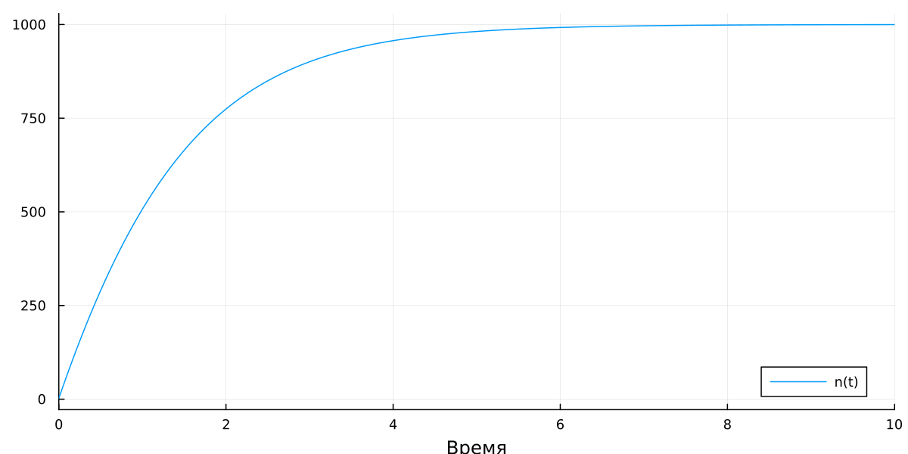
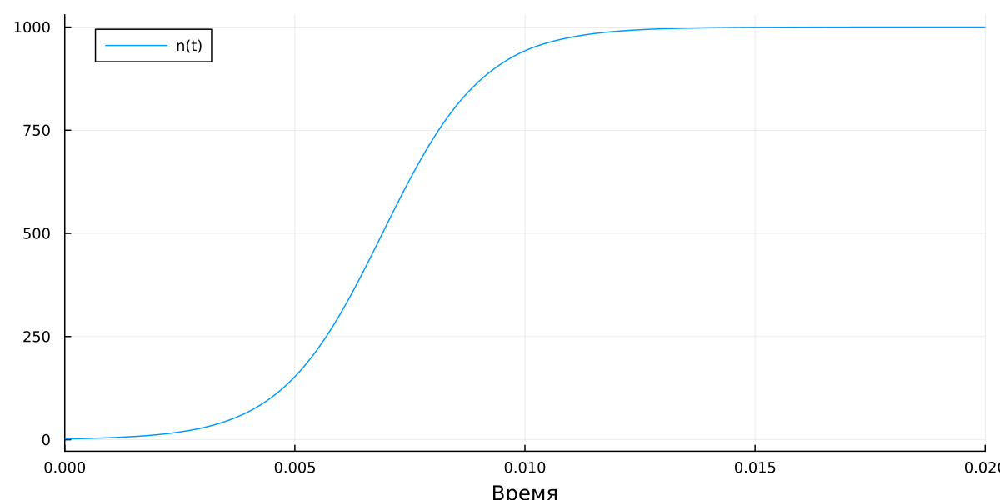
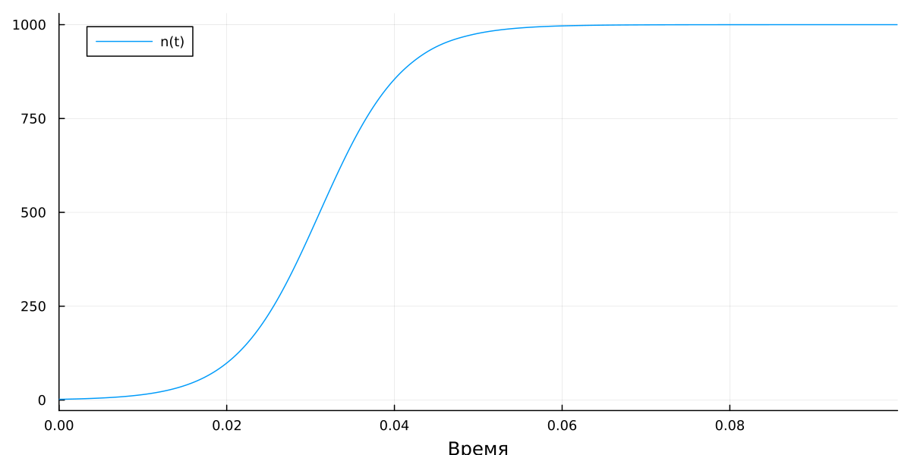
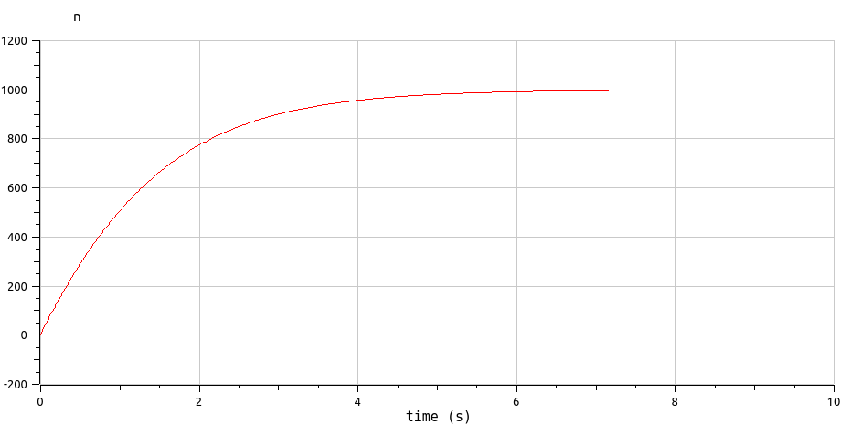
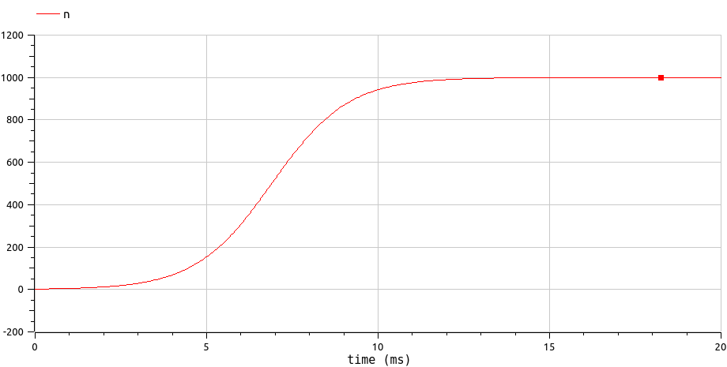
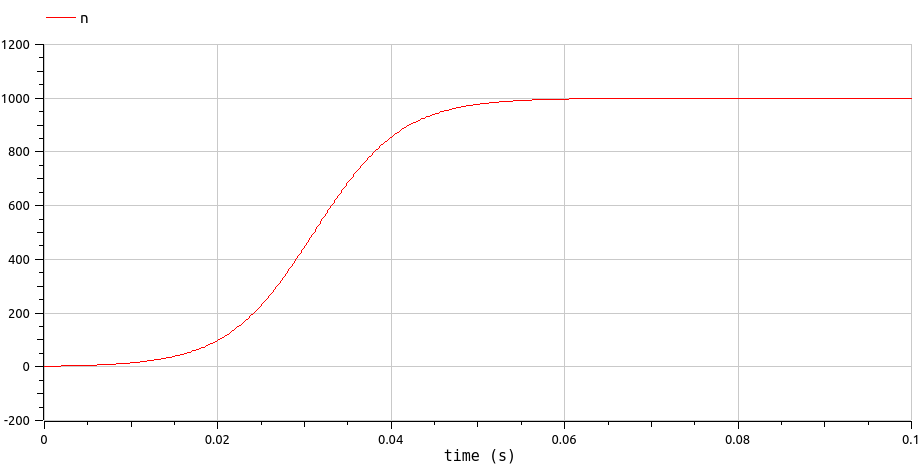

---
## Front matter
title: "Отчет по лабораторной работе №7"
subtitle: "по дисциплине: Математическое моделирование"
author: "Логинов Е.И."

## Generic otions
lang: ru-RU
toc-title: "Содержание"

## Bibliography
bibliography: bib/cite.bib
csl: pandoc/csl/gost-r-7-0-5-2008-numeric.csl

## Pdf output format
toc: true # Table of contents
toc-depth: 2
lof: true # List of figures
lot: false # List of tables
fontsize: 12pt
linestretch: 1.5
papersize: a4
documentclass: scrreprt
## I18n polyglossia
polyglossia-lang:
  name: russian
  options:
	- spelling=modern
	- babelshorthands=true
polyglossia-otherlangs:
  name: english
## I18n babel
babel-lang: russian
babel-otherlangs: english
## Fonts
mainfont: PT Serif
romanfont: PT Serif
sansfont: PT Sans
monofont: PT Mono
mainfontoptions: Ligatures=TeX
romanfontoptions: Ligatures=TeX
sansfontoptions: Ligatures=TeX,Scale=MatchLowercase
monofontoptions: Scale=MatchLowercase,Scale=0.9
## Biblatex
biblatex: true
biblio-style: "gost-numeric"
biblatexoptions:
  - parentracker=true
  - backend=biber
  - hyperref=auto
  - language=auto
  - autolang=other*
  - citestyle=gost-numeric
## Pandoc-crossref LaTeX customization
figureTitle: "Рис."
tableTitle: "Таблица"
listingTitle: "Листинг"
lofTitle: "Список иллюстраций"
lotTitle: "Список таблиц"
lolTitle: "Листинги"
## Misc options
indent: true
header-includes:
  - \usepackage{indentfirst}
  - \usepackage{float} # keep figures where there are in the text
  - \floatplacement{figure}{H} # keep figures where there are in the text
---

# Цель работы

Продолжить знакомство с функционалом языка программирования Julia, дополнительных библиотек (DifferentialEquations, Plots), интерактивного блокнота Pluto, а также интерактивной командной строкой REPL. Продолжить ознакомление с языком моделирования Modelica и программным обеспечением OpenModelica. Используя эти средства, описать математическую модель рекламной компании.

# Задание

Постройте график распространения рекламы, математическая модель которой описывается следующим уравнением:

1. $\frac{dn}{dt} = (0.65+0.0002n(t))(N-n(t))$

2. $\frac{dn}{dt} = (0.0003+0.9n(t))(N-n(t))$

3. $\frac{dn}{dt} = (0.1 \cdot sin(2t) + 0.2 \cdot cos(3t) \cdot n(t))(N-n(t))$

При этом объем аудитории $N=1000$, в начальный момент о товаре знает $2$ человека. Для случая 2 определите в какой момент времени скорость распространения рекламы будет иметь максимальное значение.

# Теоретическое введение
## Модель рекламной кампании

__Модель рекламной кампании__ — математическая модель, описывающая скорость распространения информации о новом товаре какой-либо компании среди потенциальных покупателей. В нашем случае будем считать, что при распространении информации о товаре на покупателя, он сразу же готов купить рекламируемый товар.

Оценка скорости распространения информации о товаре важна при оценки прибыли от будущих продаж товара по сравнению с избытками издержек, потраченных на рекламу. Вначале расходы на рекламу могут превышать прибыль, но по мере увеличения числа продаж увеличивается прибыль. Однако реклама становится бесполезной, когда рынок насыщается.

Математическая модель рекламной кампании описывается следующим ОДУ:

$$\frac{dn}{dt} = (\alpha_1(t) + \alpha_2(t)n(t))(N-n(t)), $$

где $N$ — число потенциальных клиентов; $n(t)$ — число клиентов, информированных о товаре и готовых его купить; $\frac{dn}{dt}$ — изменение числа клиентов, информированных о товаре и готовых его купить, со временем; $\alpha_1(t)$ — величина, характеризующая интенсивность рекламной компании; $\alpha_2(t)$ — величина, характеризующая интенсивность т.н. «сарафанного радио».

При $\alpha_1(t)$ значительно большем, чем $\alpha_2(t)$, график зависимости $n(t)$ от $t$ будет являться экспоненциальным графиком, а математическая модель будет называться моделью Мальтуса.

При $\alpha_1(t)$ значительно меньшем, чем $\alpha_2(t)$, получим уравнение логистической кривой [@rudn].


## Уравнение модели Мальтуса

__Модель Мальтуса__ — это математическая модель, разработанная теоретиком демографии Томасом Мальтусом в XVIII веке, для описания изменения численности населения в течение времени. Мальтус утверждал, что население удваивается каждые 25 лет, а производство продовольствия может увеличиться только линейно. Следовательно, рост населения будет приводить к недостатку пищи и, в конечном итоге, к голоду, болезням и смерти, которые уменьшат численность населения до уровня, соответствующего доступным ресурсам [@studme].

Модель Мальтуса описывает экспоненциальный рост численности населения. Она основана на предположении, что скорость роста численности населения пропорциональна численности населения в данный момент времени. Если обозначить численность населения в момент времени $t$ через $P(t)$, то модель Мальтуса можно записать в следующей форме:

$$ \frac{dP}{dt} = r \cdot N, $$

где $dP/dt$ — скорость изменения численности населения со временем, $P$ — текущая численность населения, $r$ — коэффициент рождаемости.

Решением этого дифференциального уравнения является экспоненциальная функция:

$$ P(t) = P_0 \cdot e^{rt}, $$

где $P(t)$ — численность населения в момент времени $t$, $P_0$ — исходная численность населений, $r$ — темп прироста населения («мальтузианский параметр»).

Таким образом, модель Мальтуса описывает экспоненциальный рост численности населения, то есть увеличение численности населения со временем происходит не пропорционально, а с постоянной скоростью, и эта скорость также увеличивается со временем. Однако, следует отметить, что в реальной жизни экспоненциальный рост на неограниченном промежутке времени невозможен, так как имеются ограничения в ресурсах и пространстве, необходимых для поддержания роста численности населения.

Модель Мальтуса имеет множество ограничений: она не учитывает такие факторы, как миграция, изменения в общественной политике и технологическом прогрессе, которые также влияют на изменение численности населения. Несмотря на это, модель Мальтуса остается важным теоретическим инструментом в изучении демографии и популяционных процессов [@malthus].


## Уравнение логистической кривой

__Логистическое уравнение__ — это S-образная кривая (сигмоидальная кривая), изначально используемая при построении математических моделей, описывающих изменение размера популяции со временем с учетом ограничений, налагаемых окружающей средой. Уравнение было предложено Пьером Ферхюльстем в 1838 году [@log].

Логистическое уравнение имеет следующий вид:

$$\frac{dN}{dt} = rN(1-\frac{N}{K})$$

где $N$ — размер популяции в момент времени $t$, $r$ — скорость роста популяции (без учета ограничений), $K$ — предельная вместимость среды.

Первое слагаемое в скобках описывает скорость роста популяции, а второе - ограничивает этот рост учитывая, что на определенном уровне популяции возможности среды ограничивают скорость дальнейшего роста.

Важно отметить, что при малых значениях $N$, то есть когда популяция еще не насытила среду, рост популяции описывается экспоненциальной моделью (без второго слагаемого в скобках). Однако при увеличении размера популяции, ограничения среды начинают влиять на скорость роста, и популяция переходит на устойчивое состояние - точку равновесия, которая соответствует величине $K$.

Логистическое уравнение находит применение в различных областях, таких как экология, демография, экономика, теория управления и другие .


# Выполнение лабораторной работы
## Pluto.jl
### Задание №1-3

1. Пишем программу, воспроизводящую модель на языке программирования Julia. Подставляем коэффициенты $\alpha_1$ и $\alpha_2$ и изменяем период времени. Анализируем полученные графики (рис. @fig:01, @fig:02, @fig:03).

    ```Julia
    using Plots
    using DifferentialEquations

    a_1 = 0.65
    a_2 = 0.0002

    T1 = (0.0, 10.0)
    u0 = [2]
    N = 1000

    function F!(du, u, p, t)
        du[1] = (a_1 + a_2 * u[1]) * (N - u[1])
    end

    prob1 = ODEProblem(F!, u0, T1)
    sol1 = solve(prob1)

    plt1 = plot(sol1, dpi = 150, size = (800, 400), xlabel = "Время", label = "n(t)")
    savefig(plt1, "img_lab7v1jl.png")

    a_1 = 0.0003
    a_2 = 0.9

    T2 = (0.0, 0.02)
    prob2 = ODEProblem(F!, u0, T2)
    sol2 = solve(prob2)

    plt2 = plot(sol2, dpi = 150, size = (800, 400), xlabel = "Время", label = "n(t)")
    savefig(plt2, "img_lab7v2jl.png")

    function Fv2!(du, u, p, t)
        du[1] = (a_1*sin(2*t) + a_2 * cos(3*t) * u[1]) * (N - u[1])
    end

    a_1 = 0.1
    a_2 = 0.2

    T3 = (0.0, 0.1)
    prob3 = ODEProblem(Fv2!, u0, T3)
    sol3 = solve(prob3)

    plt3 = plot(sol3, dpi = 150, size = (800, 400), xlabel = "Время", label = "n(t)")
    savefig(plt3, "img_lab7v3jl.png")
    ```

    {#fig:01 width=86%}
    
    {#fig:02 width=86%}
    
    {#fig:03 width=86%}


## Modelica
### Задание №1-3

1. По аналогии с Julia пишем программу, воспроизводящую модель рекламной кампании на языке моделирования Modelica с использованием ПО OpenModelica. Любуемся результатами (рис. @fig:04, @fig:05, @fig:06).
    
    ```Modelica
    model lab7v1
      constant Real a_1 = 0.65;
      constant Real a_2 = 0.0002;
      constant Integer N = 1000;
      constant Integer n0 = 2;
      Real n(time);
    initial equation
      n = n0;
    equation
      der(n) = (a_1 + a_2*n)*(N - n);
    end lab7v1;
    ```
    
    {#fig:04 width=86%}
    
    {#fig:05 width=86%}
    
    {#fig:06 width=86%}


# Анализ результатов

На текущем примере построения математической модель рекламной кампании мы можем продолжить сравнивать язык программирования Julia и язык моделирования Modelica. Если быть откровенным, по сравнению с анализом результатов при выполнении предыдущей лабораторной работы изменения незначительны: тенденция к сглаживанию негативных моментов при выполнении лабораторной работы на языке программирования Julia по сравнению с языком моделирования Modelica продолжается. Со временем и с новыми заданиями, решаемыми при помощи библиотеки DifferentialEquations, скорость написания программ на Julia почти сравнялась с таковой скоростью при использовании Modelica.

На языке Julia можно явно найти момент времени, во время которого скорость изменения функции $n(t)$ (т.е. $\dot n$) максимальна, т.к. мы можем напрямую взаимодействовать со значениями производной в каждый момент времени, обусловленный шагом разбиения. Это позволяет достаточно легко находить максимальное значение производной на периоде, момент времени в этой точки, а также само значение функции $n(t)$ в этой точке.

При написании же программы на Modelica приходится вручную искать максимальное значение по графику производной функции $n(t)$.

С другой стороны, хотелось бы отметить, что в Modelica в разы удобнее составлять уравнения, т.к. все переменные, зависящие от времени, подписываются заданными ранее символами в отличие от Julia, где каждой переменной соответствует элемент массива. Такая реализация может запутать, что может привести к ошибкам, связанными с усидчивостью, при описании модели.

# Выводы

Продолжил знакомство с функционалом языка программирования Julia, дополнительных библиотек (DifferentialEquations, Plots). Продолжил ознакомление с языком моделирования Modelica и программным обеспечением OpenModelica. Используя эти средства, описал математическую модель рекламной кампании.


# Список литературы{.unnumbered}

::: {#refs}
:::
